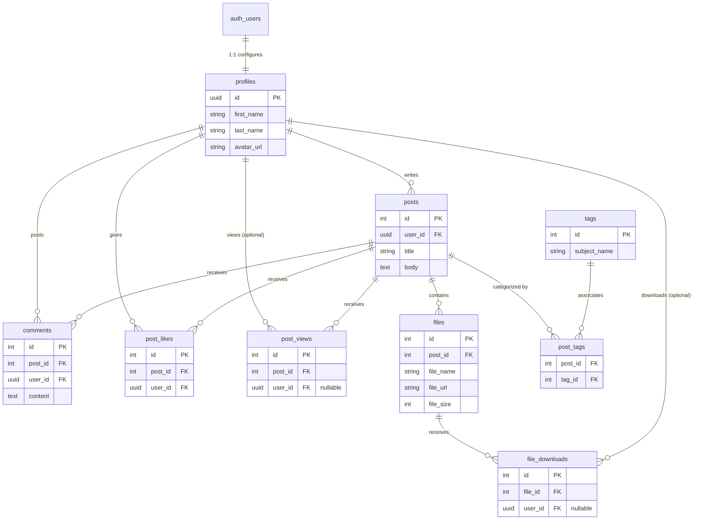

# RuamLem

A full-stack monorepo project designed with modern web technologies. `RuamLem` features a scalable layered backend powered by Bun and ElysiaJS, and a high-performance frontend built with Next.js (App Router) and Tailwind CSS. The data and authentication layers are handled by Supabase.

---

## 🏛 Architecture Overview

The repository is structured as a monorepo containing two main parts:
- **`frontend/`**: The web application client.
- **`backend/`**: The REST API and services backend.

Both applications use **TypeScript** to ensure end-to-end type safety and smooth development context switching.

---

## 🛠 Tech Stack

### Frontend
- **Framework**: [Next.js 15](https://nextjs.org/) (App Router format for optimized server/client rendering)
- **UI & Styling**: React 19, [Tailwind CSS 4](https://tailwindcss.com/)
- **State & Data Fetching**: React Hooks, Axios
- **Build Tool**: Next.js Turbopack
- **Analytics**: Vercel Analytics

### Backend
- **Runtime**: [Bun](https://bun.sh/)
- **Framework**: [ElysiaJS](https://elysiajs.com/) (Fast, type-safe web framework)
- **Database & Auth**: [Supabase](https://supabase.com/)
- **Documentation**: Swagger/OpenAPI (via `@elysiajs/openapi`)
- **Other libraries**: bcrypt (hashing), jsdom

---

## 📂 Project Structure

```text
RuamLem/
├── backend/                  # ElysiaJS Backend
│   ├── src/
│   │   ├── controllers/      # Request handlers & logic endpoints
│   │   ├── routes/           # API Route declarations
│   │   ├── services/         # Core business logic processing
│   │   ├── repositories/     # Data access layer (Supabase interaction)
│   │   └── utils/            # Shared utilities & middleware (logger, etc.)
│   └── tests/                # Test suites & unit tests
│
└── frontend/                 # Next.js Frontend
    ├── src/
    │   ├── app/              # App Router pages and layouts
    │   ├── components/       # Reusable React components (Navbar, Posts, UI)
    │   ├── hooks/            # Custom React Hooks (e.g., useAuth)
    │   ├── lib/              # Client utilities and helpers (API instances)
    │   ├── services/         # API integration services matching backend domain
    │   └── types/            # TypeScript interfaces & domain types
    └── docs/                 # Documentation (Supabase Analytics info)
```

---

## 🧩 Backend Design

The backend uses a strict **Layered Architecture** to enforce separation of concerns:

1. **Routes (`/routes`)**: Defines the Elysia endpoints and HTTP methods. Directs incoming requests to the appropriate controllers.
2. **Controllers (`/controllers`)**: Validates input data, extracts parameters, coordinates the business flow by calling services, and formats the HTTP responses.
3. **Services (`/services`)**: Contains the core business rules and logic. It calculates, processes, and decides how data should be transformed.
4. **Repositories (`/repositories`)**: Interacts directly with the database (Supabase). This is the only layer that executes queries and mutations against the persistent storage.

### Modules Available
- **Auth**: Authentication and authorization processes.
- **Admin**: Administrative tools and moderation controls.
- **Analytics & Stats**: Data gathering, metrics evaluation, and system statistics.
- **Posts**: Creating, modifying, deleting, and fetching user posts.
- **Profiles**: User profile management and data visualization.
- **Likes & Files**: Interaction mechanisms and media/file uploading endpoints.

---

## 🗄️ Database Design

The data layer uses PostgreSQL (via Supabase) utilizing a relational approach. The database schema has evolved from its initial manual design to a more robust representation bridging application needs with Supabase's ecosystem.

### 🎨 Initial Database Design
The original database architecture was a conceptual draft manually mapped out using dbdiagram.io, serving as the starting layout for features encompassing users, posts, and tags.

<!-- เดี๋ยวเอามาลง -->

### 🛠️ Real Implementation
The live schema expanded upon the initial draft, replacing generic identifiers with Supabase-native ones, accounting for engagement tracking, and optimizing specific entities.



#### Core Entities
- **profiles:** Extends the basic `auth.users` managed by Supabase, storing application-specific details like first name, last name, and avatar configurations.
- **posts:** The main content hub generated by users containing textual content and titles.
- **files:** Handles post attachments storing media/document metadata (URL, file size) pointing to the Supabase Storage Buckets.
- **comments:** Allows conversational data nested under individual post entities.
- **tags / post_tags:** A many-to-many relationship resolving categorization for the content. The frontend dynamically resolves the primary post "category" based on the first associated tag.
- **post_likes, post_views, file_downloads:** Junction tables explicitly tracking granular engagements—not just simple counters on the main table.

### 🔄 Differences

1. **User Table Replaced by Profiles (Supabase Integration)**
   - *Initial Design*: Assumed a generic `users` table with an auto-incrementing integer `id` and a basic `username` field.
   - *Real Implementation*: Delegates core authentication to Supabase's internal `auth.users`. An application-level `profiles` table is now used, tracking a `uuid` representing the logged-in user, along with granular application-specific fields (`first_name`, `last_name`, `avatar_url`, and `bio`).

2. **Expanded Granular Engagement Tracking (Likes, Views, Downloads)**
   - *Initial Design*: Did not specify how users would like posts, view counts, or track engagements.
   - *Real Implementation*: Instead of intrinsic integer counters on the `posts` table, dedicated `post_likes`, `post_views`, and `file_downloads` tables were introduced. This isolates analytics per exact user or anonymous session, offering much higher analytic fidelity.

3. **Dynamic Frontend Categorization**
   - *Initial Design*: Focused purely on basic relational tables mapping posts.
   - *Real Implementation*: Instead of relying purely on a hardcoded "category" string, the backend resolves arrayed entries in `tags` and exposes this for the frontend to compute category abstractions dynamically.

---

## 💻 Frontend Design

The frontend strictly follows Next.js App Router conventions:

- **Routing (`src/app`)**: Route segments organized into logical paths (`/admin`, `/community`, `/profile`, `/signin`, `/signup`, `/post`). Nested routing is used for features like `[id]` (view post) and `[id]/edit` (edit post).
- **Component Design (`src/components`)**: Reusable UI parts are decoupled from the routing. Contains layout shells, `auth-guard` for protected routes, and interaction elements like `post-button` or `searchbox`.
- **API Services (`src/services`)**: Strongly typed Axios wrappers abstracting backend API calls.
- **Authentication Flow**: Supports a robust flow from standard Sign-up/Sign-in to email confirmation, password resets, and forgot-password routines. 

---

## 🚀 Getting Started

### Prerequisites
- [Bun](https://bun.sh/) installed locally (used for both frontend and backend).
- A [Supabase](https://supabase.com/) project configured with proper tables and buckets.

### Running Backend
```bash
cd backend
bun install
bun run dev
```

### Running Frontend
```bash
cd frontend
bun install
bun run dev
```

---

## 📄 License
This project is properly licensed. See the `LICENSE` files inside the `backend/` and `frontend/` directories for details.

